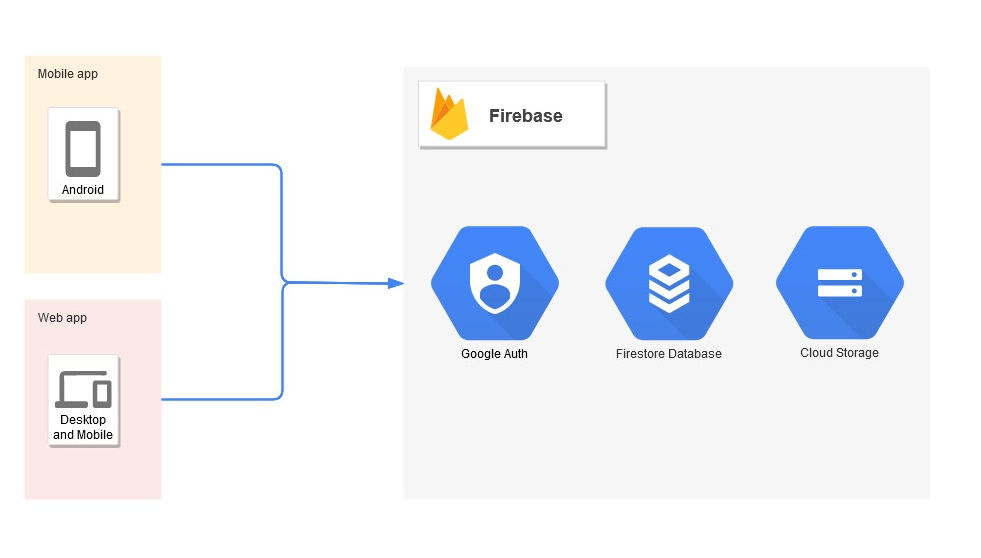

# LiftCrane
## Description
LiftCrane is Computerised Maintenance Management System (CMMS) made for small lift maintance company (6 people).
Designed to make easier to log reapirs and revisions on serviced machines.

Service engeneer only needs to scan device's QR code with his Android phone and check relevant checkboxes to save his visit.

Management can check sheduled technical services, analise historical data, update list of machines using intuitive web application.

## Tools used :
  - Kotlin for android app
  - Vue.js for web app
  - Firebase firestore 
  - Firebase auth service
  - Firebase hosting
  - Firebase storage
  
     
##Architecture diagram        

## Trusted by

[Zygfrydlift](https://zygfrydlift.pl/)
